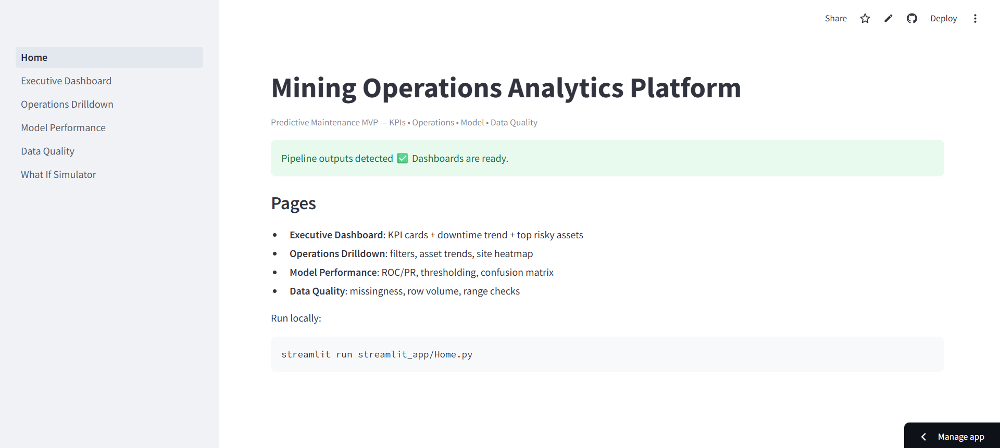
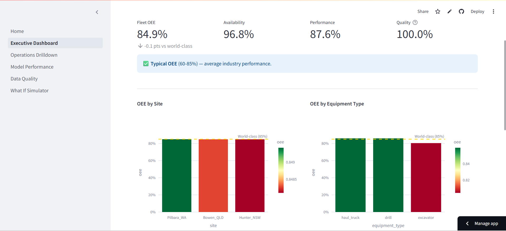
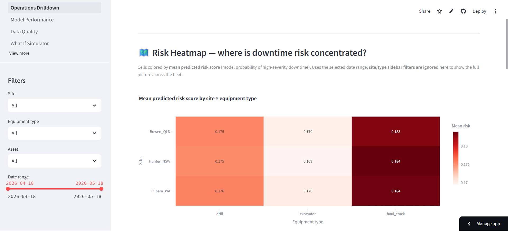
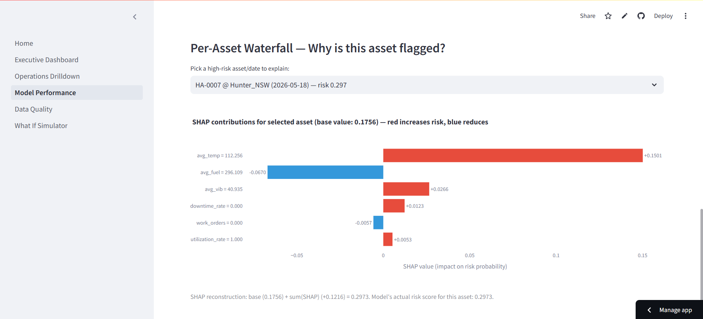
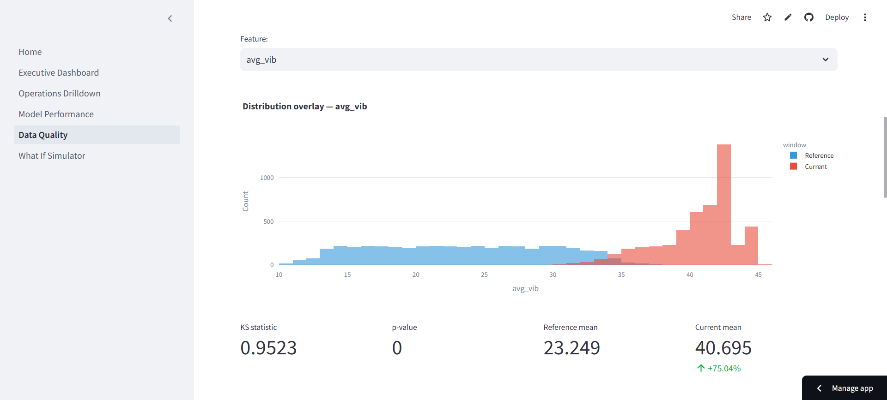

# Mining Operations Analytics Platform

Predictive Maintenance MVP for industrial mining equipment. This project demonstrates a production-style analytics workflow where telemetry and maintenance signals are transformed into operational KPIs, downtime-risk scoring, executive dashboards, and data quality monitoring - delivered via a cloud-deployed Streamlit application.

---

## 1. Live Demo

**Streamlit App**  
https://fahadamjad009-mining-operations-analyt-streamlit-apphome-iuilko.streamlit.app

---

## 2. Screenshots

### Home


### Executive Dashboard


### Operations Drilldown


### Model Performance


### Data Quality


---

## 3. Objectives

1. Convert equipment telemetry and maintenance activity into daily operational KPIs  
2. Score equipment downtime risk using an evaluation-first ML approach  
3. Provide operational and executive dashboards for decision support  
4. Monitor dataset health via automated data quality checks  
5. Deploy a stable, cloud-safe Streamlit application resilient to cold starts  

---

## 4. Architecture

### 4.1 High-Level Flow

flowchart LR
  A[Telemetry + Maintenance Data] --> B[ETL and Feature Engineering]
  B --> C[Daily KPI Table (Parquet)]
  B --> D[Model Training (scikit-learn)]
  C --> E[KPI Snapshot (CSV)]
  D --> F[Downtime Risk Model (joblib)]
  C --> G[Streamlit Dashboards]
  E --> G
  F --> G
  G --> H[Streamlit Cloud]
  
### Text fallback (if Mermaid does not render)

```
Telemetry + Maintenance
        |
        v
ETL / Feature Engineering
        |
        v
Daily KPI Table (Parquet)
        |-- KPI Snapshot (CSV)
        `-- Model Training -> Risk Model (joblib)
                    |
                    v
              Streamlit App
                    |
                    v
              Streamlit Cloud
```

---

### 4.2 Cloud-Safe Behavior

Streamlit Cloud runs on a clean container. The application includes a bootstrap mechanism that:

- Detects missing pipeline artifacts  
- Generates demo artifacts inside the container on demand  
- Prevents broken pages after redeploy or cold start  

---

## 5. Dashboard Pages

### 5.1 Executive Dashboard

- KPI cards (coverage, utilization, downtime)  
- Downtime trend  
- Top risky assets table  

### 5.2 Operations Drilldown

- Filters (site, equipment type, asset, date range)  
- Utilization and downtime trends  
- Site comparison  
- Top downtime assets  

### 5.3 Model Performance

- ROC / AUC  
- Risk score distribution  
- Threshold tuning  
- Confusion matrix  
- Precision / Recall / F1  

### 5.4 Data Quality

- Missingness by column  
- Row volume over time  
- Range checks and sanity validation  

---

## 6. Tech Stack

- Python 3.11  
- Streamlit  
- Pandas  
- NumPy  
- Scikit-learn  
- Joblib  
- Plotly  
- PyArrow  

---

## 7. Repository Structure

```
mining-operations-analytics-platform/
|
|-- streamlit_app/
|   |-- Home.py
|   |-- bootstrap.py
|   `-- pages/
|       |-- 1_Executive_Dashboard.py
|       |-- 2_Operations_Drilldown.py
|       |-- 3_Model_Performance.py
|       `-- 4_Data_Quality.py
|
|-- src/
|   `-- miningops/
|
|-- data/
|-- docs/
|   `-- screenshots/
|
|-- requirements.txt
`-- runtime.txt
```

---

## 8. Running Locally

### 8.1 Setup

```bash
git clone https://github.com/fahadamjad009/mining-operations-analytics-platform.git
cd mining-operations-analytics-platform
pip install -r requirements.txt
```

### 8.2 Generate Demo Data

```bash
python -m src.miningops.generate_data
python -m src.miningops.kpis
python -m src.miningops.train
```

### 8.3 Start Streamlit

```bash
streamlit run streamlit_app/Home.py
```

---

## 9. Deployment Stability Notes

- Python version pinned via `runtime.txt`  
- Dependencies pinned in `requirements.txt`  
- Cloud bootstrap auto-generates missing artifacts  
- Stable baseline Git tag:

```
savepoint-streamlit-stable-2026-02-22
```

---

## 10. Future Enhancements

- Real telemetry ingestion  
- Drift monitoring  
- Alert routing (email / ops tools)  
- Multi-site scaling  
- Experiment tracking dashboard  

---


