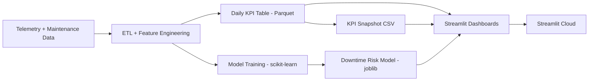

# Mining Operations Analytics Platform

[](https://mining-ops-analytics.streamlit.app)
[](https://www.python.org/downloads/release/python-3110/)
[](LICENSE)
[]()

End-to-end **predictive maintenance and operational analytics platform** for industrial mining equipment. Demonstrates a production-style ML workflow: telemetry → daily KPIs → downtime-risk scoring (scikit-learn) → executive / operational / ML / data-quality dashboards → interactive what-if scenarios → cloud deployment.

Built on the **NASA C-MAPSS turbofan benchmark** recast into mining ops framing (haul trucks, excavators, drills).

> 🚀 **Live demo:** [mining-ops-analytics.streamlit.app](https://mining-ops-analytics.streamlit.app)
>
> Streamlit Cloud cold-starts on clean containers. If a page shows "missing artifacts," click **Generate demo data now** on the Home page to bootstrap the pipeline inside the container.
>
> 📦 **Zero external downloads:** the NASA C-MAPSS benchmark data is bundled under `data/raw/nasa_cmapss/CMAPSSData/` — clone, install, and the pipeline runs end-to-end.

---

## Quick tour

| Page | What it shows |
| --- | --- |
| **Home** | Project overview + one-click demo data bootstrap for cloud cold-starts |
| **Executive Dashboard** | 5 tabs: Overview · OEE & Reliability (with 85% world-class benchmark) · MTBF/MTTR · Downtime Pareto (80/20) · Cost Impact (configurable $/hr × catch-rate sliders) |
| **Operations Drilldown** | **Risk heatmap** (site × equipment-type matrix, mean predicted risk) + utilization/downtime trends + site comparison + filterable asset tables |
| **Model Performance** | 4 tabs: ROC & Threshold tuning · **Calibration** (reliability diagram + Brier score) · **Lift & Gains** (cumulative gains, lift curve, decile insights) · **SHAP Explainability** (global importance + per-asset waterfall) |
| **Data Quality** | **Kolmogorov-Smirnov drift detection** (configurable date split, per-feature KS stat / p-value / mean shift, distribution overlay) + missingness + row volume + range checks |
| **What-If Simulator** | Interactive sliders per model feature → **live recomputed risk score** + fleet percentile + on-demand SHAP local explanation. Sensitivity testing and intervention modeling in one tool. |

---

## Screenshots

_Screenshots reflect baseline pages; latest tab structure and Tier 2/3 features (SHAP, drift detection, risk heatmap, what-if simulator) are best viewed in the live demo._

### Home


### Executive Dashboard


### Operations Drilldown


### Model Performance


### Data Quality


---

## Honest limitations

This is a portfolio project, not a production system. Disclosures:

- **Synthetic data.** Uses NASA C-MAPSS turbofan benchmark recast into mining ops framing. Physics is realistic; data is not from real mining operations.
- **Model performance.** ROC AUC **0.639** on the evaluation set. Realistic for raw C-MAPSS aggregates without deep feature engineering — and **leakage-free**: the training pipeline auto-detected and removed a leaky `high_sev` feature that was inflating scores to artificial perfection.
- **Drift is expected behavior.** All seven features flag KS-significant drift between reference and current windows. This is **correct** — C-MAPSS simulates engine degradation, so distributions genuinely shift over time as components wear. The detector is catching the wear signal, not a pipeline bug.
- **Cost impact is illustrative.** The $/hour and model catch-rate sliders on the Executive Dashboard are configurable assumptions. The annualized cost-avoidance figure shows the calculation pattern, not a defensible business case for a real operator.
- **No real-time ingestion.** The pipeline is batch — telemetry generated, KPIs computed, model trained all upfront. Production would need streaming ingestion, incremental retraining, alert routing, ops integration.

---

## Architecture



### Cloud-safe bootstrap

Streamlit Cloud runs on clean containers. The app includes a bootstrap mechanism that:

- Detects missing pipeline artifacts on cold start
- Generates demo artifacts on demand via a single button
- Prevents broken pages after redeploy

---

## Tech stack

- **Python** 3.11 (pinned via `runtime.txt`)
- **Streamlit** — multi-page UI framework
- **scikit-learn** 1.4.2 — model training (Pipeline + classifier with leakage detection)
- **Classifier** — scikit-learn binary classifier wrapped in a Pipeline (see `src/miningops/train.py` for algorithm choice and hyperparameters)
- **SHAP** 0.46.0 — explainability (Kernel + Tree explainers)
- **scipy.stats** — Kolmogorov-Smirnov 2-sample test for drift detection
- **Plotly** — interactive charts (heatmaps, distributions, waterfalls)
- **Pandas / NumPy / PyArrow** — data layer (Parquet)
- **Joblib** — model serialization

---

## Repository structure

```
mining-operations-analytics-platform/
├── streamlit_app/
│   ├── Home.py                          # Entry + cloud bootstrap
│   ├── bootstrap.py                     # Demo data regeneration logic
│   └── pages/
│       ├── 1_Executive_Dashboard.py     # OEE, Pareto, cost impact
│       ├── 2_Operations_Drilldown.py    # Risk heatmap + drilldowns
│       ├── 3_Model_Performance.py       # ROC, calibration, lift, SHAP
│       ├── 4_Data_Quality.py            # Drift detection + DQ checks
│       └── 5_What_If_Simulator.py       # Interactive sensitivity tool
├── src/miningops/
│   ├── generate_data.py                 # Synthetic telemetry from C-MAPSS
│   ├── kpis.py                          # Daily aggregation + features
│   └── train.py                         # Model training + leakage detection
├── data/
│   ├── raw/nasa_cmapss/CMAPSSData/      # Bundled NASA benchmark dataset
│   └── processed/                       # Pipeline outputs (gitignored)
├── docs/screenshots/                    # Dashboard captures
├── reports/                             # Published analysis reports + figures
├── .github/workflows/                   # CI smoke tests
├── tests/                               # Unit + integration tests
├── requirements.txt                     # Pinned dependencies
├── runtime.txt                          # Python 3.11
├── .env.example                         # Environment variables template
├── LICENSE                              # MIT
└── README.md
```

---

## Running locally

```bash
git clone https://github.com/fahadamjad009/mining-operations-analytics-platform.git
cd mining-operations-analytics-platform
pip install -r requirements.txt

# Generate demo data + train model
python -m src.miningops.generate_data
python -m src.miningops.kpis
python -m src.miningops.train

# Launch
streamlit run streamlit_app/Home.py
```

App opens at `http://localhost:8501`.

---

## Roadmap

- [x] **Tier 1** — Executive Dashboard (OEE, MTBF/MTTR, Pareto, cost impact)
- [x] **Tier 2** — Model Performance (ROC, calibration, lift & gains, SHAP)
- [x] **Tier 3** — Risk heatmap (Operations Drilldown)
- [x] **Tier 3** — KS-test drift detection (Data Quality)
- [x] **Tier 3** — What-If Simulator with live SHAP local explanations
- [ ] Refresh screenshots to reflect Tier 2/3 features
- [ ] Real-time telemetry ingestion (Kafka or polling)
- [ ] Drift-triggered automated retraining loop
- [ ] Alert routing (email / Slack / PagerDuty)
- [ ] MLflow experiment tracking integration

---

## Stable baselines

Pre-Tier-1 baseline preserved as a known-working snapshot:

- **Tag:** `savepoint-streamlit-stable-2026-02-22`

---

## License

MIT — see [LICENSE](LICENSE).