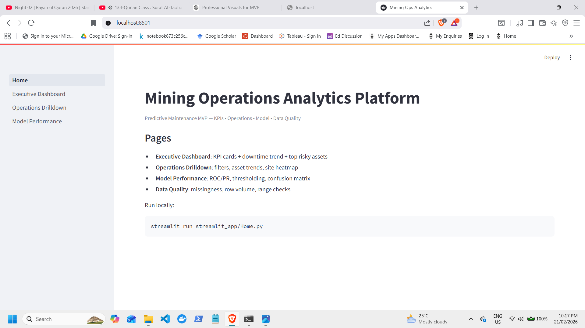
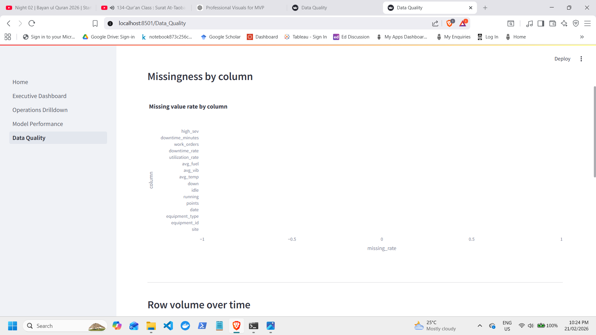
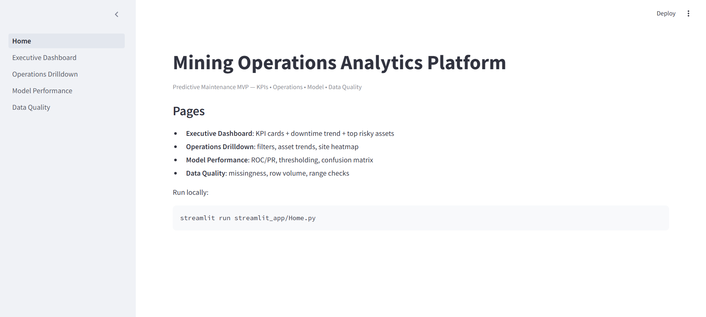
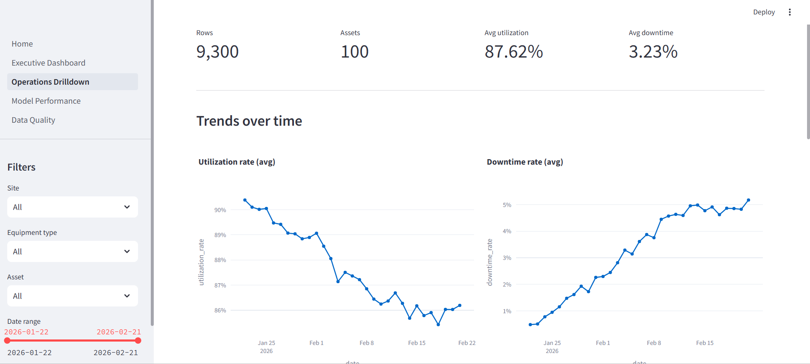
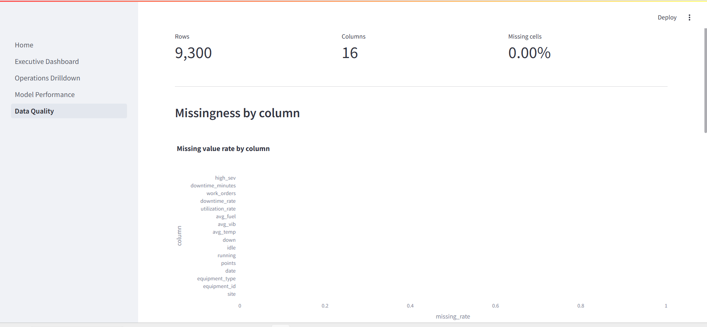

# Mining Operations Analytics Platform

Predictive Maintenance MVP for industrial mining equipment. This project demonstrates a production-style analytics workflow: telemetry and maintenance signals are transformed into operational KPIs, downtime-risk scoring, dashboard drilldowns, and data quality monitoring, delivered as a cloud-deployed Streamlit app.

## 1. Live Demo

Streamlit App: https://fahadamjad009-mining-operations-analyt-streamlit-apphome-iuilko.streamlit.app

## 2. Screenshots

Home  


Executive Dashboard  


Operations Drilldown  


Model Performance  


Data Quality  


## 3. Objectives

1. Convert equipment telemetry and maintenance activity into daily operational KPIs.
2. Score equipment downtime risk with an evaluation-first ML approach.
3. Provide operational and executive dashboards for decision support.
4. Monitor dataset health via automated data quality checks.
5. Deploy a stable, cloud-safe Streamlit application that remains functional on cold starts.

## 4. Architecture

### 4.1 High-level flow (diagram)

```mermaid
flowchart LR
  A[Telemetry + Maintenance (synthetic/demo)] --> B[ETL / Feature Engineering]
  B --> C[Daily KPI Table (Parquet)]
  B --> D[Model Training (Scikit-learn)]
  C --> E[KPI Snapshot + Top Risky Assets (CSV)]
  D --> F[Downtime Risk Model (joblib)]
  C --> G[Streamlit Dashboards]
  E --> G
  F --> G
  G --> H[Streamlit Cloud]

If Mermaid is not rendered by your viewer, use this equivalent:

Telemetry + Maintenance  ->  ETL/Features  ->  Daily KPI (Parquet)
                                  |                 |
                                  |                 -> KPI Snapshot + Top Risky Assets (CSV)
                                  |
                                  -> Model Train -> Risk Model (joblib)
Daily KPI + CSV + Model  ->  Streamlit App (Pages)  ->  Streamlit Cloud

### 4.2 Cloud-safe behavior

Streamlit Cloud runs on a clean container. The app includes a bootstrap mechanism that:

detects missing pipeline artifacts

generates demo artifacts inside the container on demand

prevents broken pages when data files are absent after redeploy/reboot

## 5. Dashboard Pages

### 5.1 Executive Dashboard

KPI cards (coverage, utilization, downtime)

downtime trend

top risky assets (risk ranking + table)

### 5.2 Operations Drilldown

filters (site, equipment type, asset, date range)

utilization and downtime trends

site comparison

top downtime assets table

### 5.3 Model Performance

ROC/AUC (when both classes exist)

risk score distribution

threshold tuning

confusion matrix and precision/recall/F1

top predicted alerts table

### 5.4 Data Quality

missingness by column

row volume over time

basic range checks (utilization/downtime bounds, sensor sanity checks)

## 6. Tech Stack

Python 3.11 (runtime pinned for Streamlit Cloud)

Streamlit

Pandas, NumPy

Scikit-learn, Joblib

Plotly

Parquet via PyArrow

## 7. Repository Structure
mining-operations-analytics-platform/
├── streamlit_app/
│   ├── Home.py
│   ├── bootstrap.py
│   └── pages/
│       ├── 1_Executive_Dashboard.py
│       ├── 2_Operations_Drilldown.py
│       ├── 3_Model_Performance.py
│       └── 4_Data_Quality.py
├── src/
│   └── miningops/
├── data/
├── docs/
│   └── screenshots/
├── requirements.txt
└── runtime.txt

## 8. Running Locally

### 8.1 Setup

git clone https://github.com/fahadamjad009/mining-operations-analytics-platform.git
cd mining-operations-analytics-platform
pip install -r requirements.txt

### 8.2 Generate demo data (local)

python -m src.miningops.generate_data
python -m src.miningops.kpis
python -m src.miningops.train

### 8.3 Start the app

streamlit run streamlit_app/Home.py

## 9. Notes on Deployment Stability

Python version is pinned via runtime.txt to avoid dependency breakage.

Dependencies are pinned in requirements.txt.

A stable baseline is tagged in Git as savepoint-streamlit-stable-2026-02-22.

## 10. Future Enhancements

ingest real telemetry streams

monitoring and drift detection

alert routing (email/ops tools)

multi-site scaling and role-based views

evaluation dashboards with experiment tracking
